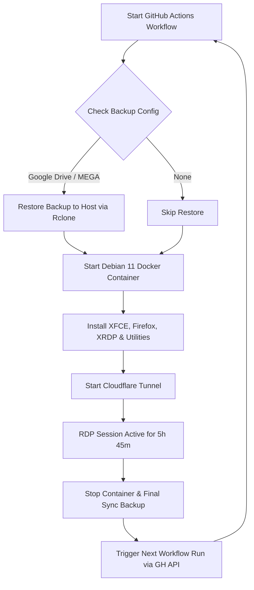

# 🚀 Persistent Debian 11 RDP Desktop on GitHub Actions

[](https://www.debian.org/)
[](https://xfce.org/)
[](https://www.cloudflare.com/products/tunnel/)
[](https://rclone.org/)

A robust, GUI-enabled **Debian 11** environment hosted inside a Docker container on GitHub Actions. It bypasses standard runner constraints (such as D-Bus limitations and short execution timeouts) by executing inside a Docker container and automatically looping workflow runs. Your workspace is fully restored from and backed up to cloud storage (Google Drive or MEGA) at the beginning and end of each session.

---

## 📌 How It Works



---

## ✨ Features

| Feature | Details |
| :--- | :--- |
| ⚡ **Dockerized isolation** | Solves D-Bus issues and XFCE loops by running in a clean `debian:11` Docker container at native runner speeds. |
| 🖥️ **Full Desktop Experience** | Lightweight XFCE4 desktop with pre-configured remote access and common utilities pre-installed. |
| 🔒 **Secure Connection** | Uses Cloudflare Tunnel (`cloudflared`) to expose the desktop securely without opening any router ports. |
| 💾 **Persistent Workspace** | Synchronizes the `/root` directory (including browser profile, settings, and documents) to Google Drive or MEGA. |
| 🔄 **Non-Stop Auto-Loop** | Automatically restarts the workflow after 5 hours and 45 minutes, downloading the latest backup to resume where you left off. |

---

## 🔑 GitHub Secrets Configuration

To run this workflow, add the following secrets to your GitHub repository under **Settings ➡️ Secrets and variables ➡️ Actions ➡️ New repository secret**:

| Secret Name | Required | Description |
| :--- | :---: | :--- |
| `PASS` | ✅ Yes | Password for the `root` user on the RDP desktop. |
| `CF_TOKEN` | ✅ Yes | Your Cloudflare Tunnel token to securely expose the connection. |
| `GDRIVE_CONF` | ⭐ Optional | Rclone config block for Google Drive. **Takes priority over MEGA.** |
| `MEGA_USER` | ⭐ Optional | Your MEGA email address (used only if `GDRIVE_CONF` is not set). |
| `MEGA_PASS` | ⭐ Optional | Your MEGA account password. |

---

## ☁️ Cloud Backup Setup

### 🔵 Option A: Google Drive *(Recommended)*

Google Drive uses `rclone` configs. Follow these steps to generate it:

1. Download and install **[Rclone](https://rclone.org/downloads/)** on your local machine.
2. Open a terminal/command prompt and run:
   ```bash
   rclone config
   ```
3. Create a new remote:
   - Name it exactly: **`gdrive`**
   - Type: Choose **`drive`** (Google Drive)
   - Follow the web authentication flow to authorize your account.
4. Once completed, find your `rclone.conf` configuration file:
   - **Windows:** `%APPDATA%\rclone\rclone.conf` (e.g., `C:\Users\<Name>\AppData\Roaming\rclone\rclone.conf`)
   - **macOS/Linux:** `~/.config/rclone/rclone.conf`
5. Open `rclone.conf`, copy the **entire** `[gdrive]` block, and paste it as the value of the **`GDRIVE_CONF`** GitHub secret.

#### 📋 Example `GDRIVE_CONF` Secret Value:
```ini
[gdrive]
type = drive
client_id = your_client_id.apps.googleusercontent.com
client_secret = your_client_secret_here
scope = drive
token = {"access_token":"ya29.xxxxxxxxxxxx","token_type":"Bearer","refresh_token":"1//xxxxxxxxxxxx","expiry":"2026-07-05T12:00:00.000Z"}
```

> [!WARNING]
> The remote block name inside the secret **must** be `[gdrive]` for the workflow to find and sync it correctly.

---

#### 📱 Setup on Mobile (Android via Termux)

You can set up your Google Drive backup configuration entirely on an Android phone using Termux:

1. **Install Termux**: Download Termux from the [F-Droid Store](https://f-droid.org/en/packages/com.termux/). *Do not use the Google Play Store version as it is outdated.*
2. **Update Packages & Install Rclone**:
   ```bash
   pkg update && pkg upgrade -y
   pkg install rclone -y
   ```
3. **Configure Rclone**:
   - Run `rclone config`, press `n` for a new remote, and name it `gdrive`.
   - Select the option number for **Google Drive**.
   - Leave `client_id` and `client_secret` blank. Choose `1` for full drive access scope.
   - When prompted for advanced config, type `n`.
   - For web browser authentication, type `y`. Termux will output a URL starting with `http://127.0.0.1:53682/`.
   - Copy the URL, paste it into Chrome on your phone, log in, and grant permissions.
   - Set Shared Drive to `n` and confirm the setup.
4. **Copy Config**:
   - Print the config: `cat ~/.config/rclone/rclone.conf`
   - Select and copy the entire `[gdrive]` block and add it to your GitHub Repository Secrets as `GDRIVE_CONF`.

---

### 🟠 Option B: MEGA *(Easiest Setup)*

If you don't want to install software locally, you can use MEGA:
1. Add your MEGA account email to the **`MEGA_USER`** GitHub secret.
2. Add your MEGA account password to the **`MEGA_PASS`** GitHub secret.

The workflow will dynamically build the MEGA configuration block on each run.

---

## 🗂️ What Gets Backed Up?

The sync backups target the **`/root`** directory in the container (mounted from `/home/runner/userdata` on the host).
* **Included:**
  * 📁 Desktop files, folders, and scripts.
  * 🌐 Firefox browser profile data (bookmarks, history, cookies, saved logins).
  * ⚙️ Application preferences and configurations stored in `/root`.
* **Excluded:**
  * `.cache/` directories to keep backups clean, fast, and lightweight.
  * System-wide binary packages and system configurations outside `/root`.

---

## 📦 Pre-Installed Software Catalog

The environment comes preloaded with essential GUI and CLI utilities:

| Category | Software Name | Description |
| :--- | :--- | :--- |
| **Desktop** | `xfce4` & `xfce4-goodies` | A clean, fast, and customisable desktop environment. |
| **Web Browser** | `firefox-esr` | Stable, privacy-respecting web browser. |
| **Media Player** | `vlc` | Feature-rich video and audio media player. |
| **Screen Record** | `simplescreenrecorder` | High-quality screen recorder for capturing workflows. |
| **Screenshots** | `xfce4-screenshooter` | Capture region, window, or entire screen. |
| **Image Viewer**| `ristretto` | Lightweight and responsive image viewer. |
| **Archiver** | `xarchiver`, `zip`, `unzip`, `p7zip-full` | Handle archives (ZIP, RAR, 7Z, TAR). |
| **Transfer** | `curl`, `rclone` | Command-line network file retrieval and cloud sync tools. |

---

## 🔌 Connection Guide

Once your workflow run is active, follow these steps to connect:

### 1. Configure Cloudflare Tunnel
Make sure your Cloudflare Tunnel is running and has a **Public Hostname** pointing to the local action runner:
* **Subdomain / Domain:** e.g., `rdp.yourdomain.com`
* **Service Type:** `TCP`
* **URL:** `localhost:3389`

### 2. Connect via RDP Client

#### Option A: Direct Hostname (If Cloudflare public mapping is configured)
1. Open your favorite RDP application:
   * **Windows:** Remote Desktop Connection (`mstsc`)
   * **macOS:** Microsoft Remote Desktop
   * **Linux:** Remmina (select RDP protocol)
2. Enter your custom hostname (e.g., `rdp.yourdomain.com`).
3. Set **Username** to `root`.
4. Enter the password you saved in the **`PASS`** GitHub secret.

#### Option B: Secure Local Bridge (Recommended for standard TCP tunnels)
If you configure a raw TCP tunnel endpoint on Cloudflare:
1. Run this command on your local computer to bind the tunnel locally:
   ```bash
   cloudflared access tcp --hostname rdp.yourdomain.com --url localhost:3389
   ```
2. Open your RDP client and connect to **`localhost:3389`**.
3. Log in using `root` and your **`PASS`** password.

---

## 🛑 How to Stop the Desktop Loop

The runner runs in a loop by dispatching the next workflow on completion.
To stop the environment permanently:
1. Go to the **Actions** tab of your repository.
2. Select the currently active **Debian 11 RDP** run.
3. Click the **Cancel run** button at the top right.
4. *(Optional)* To prevent it from starting again in the future, make sure you don't have any manual triggers pending or disable/delete the workflow.

*Note: When you cancel the workflow, the `Final Cloud Backup` step will still trigger automatically, securing your files before the runner terminates.*
